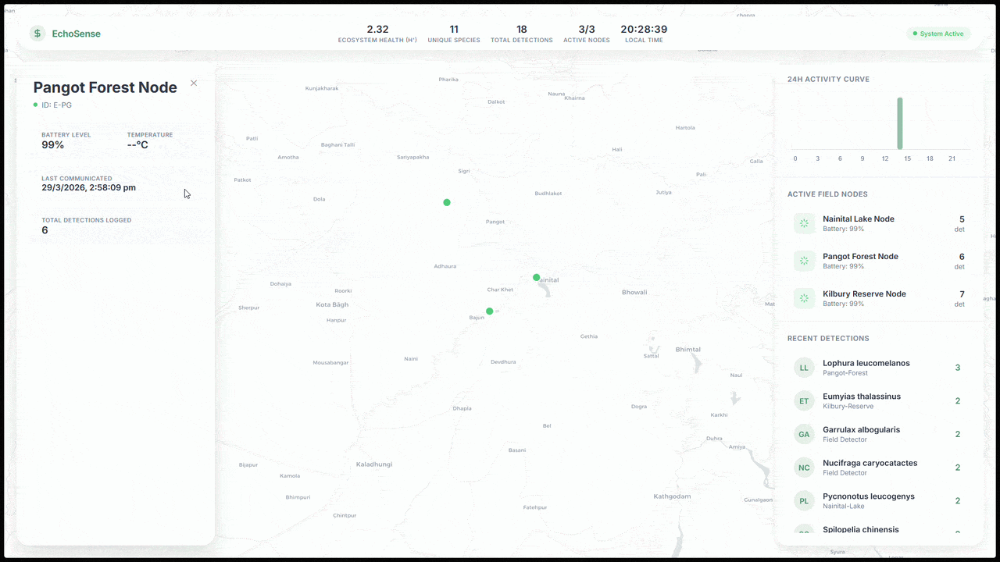
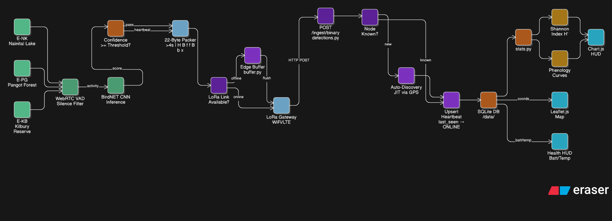

# 🦉 EchoSense

**Real-time, longitudinal biodiversity monitoring at the edge.**
EchoSense measures the pulse of ecosystems by capturing, identifying, and analyzing wildlife soundscapes in remote environments. Currently optimized for the wildlife of the **Kumaon Himalayas, Uttarakhand**, EchoSense provides an end-to-end acoustic monitoring framework that extends from physical ESP32 edge hardware to a comprehensive analytical dashboard.



---

## 📖 Table of Contents
1. [Project Overview](#project-overview)
2. [System Architecture](#system-architecture)
3. [Core Features](#core-features)
4. [Project Layout](#project-layout)
5. [Hardware (ESP32) Configuration](#hardware-esp32-configuration)
6. [Quickstart Guides](#quickstart-guides)
7. [Advanced Usage](#advanced-usage)

---

## 🌍 Project Overview

EchoSense is designed to shift heavy audio processing to the edge (the sensor level). Instead of streaming continuous gigabytes of raw audio to a server—which drains batteries and demands high-bandwidth networks—EchoSense identifies species **locally** using machine learning (BirdNET). It then transmits lightweight metadata containing the detected species, timestamp, and confidence score. This drastically reduces radio airtime and power consumption, enabling deployment in extremely remote areas.

---

## 🏗 System Architecture



The EchoSense pipeline comprises three distinct domains:
1. **Edge (Sensors & Simulation):** Captures audio, performs Voice Activity Detection (VAD), runs BirdNET classification, and packages the detection into a tiny 22-byte binary payload.
2. **Backend Engine:** A FastAPI service backed by SQLAlchemy (SQLite) that handles detection ingestion, zero-config device auto-registration, data aggregation (hourly/daily metrics), and API endpoints (REST, MQTT, CoAP options).
3. **Dashboard:** A real-time HTML/JS/CSS frontend served directly by the backend. It features Leaflet heatmaps and Chart.js analytics to visualize ecosystem diversity (Shannon Index) and species richness.

---

## ✨ Core Features

- **Edge Intelligence (BirdNET + VAD):**
  - Uses Voice Activity Detection (`webrtcvad`) to aggressively filter wind and rain noise before inference, saving CPU cycles.
  - Runs local BirdNET CNN inference natively on the hardware or edge simulator.
- **22-Byte LoRa Binary Protocol:**
  - Utilizes a custom bit-packed binary format to transmit rich detection data (device ID, timestamp, species index, confidence, coordinates, battery level) in just 22 bytes. Perfect for low-bandwidth LoRaWAN networks.
  - Specially mapped to track 20 endemic and common avian species of the Kumaon region (e.g., Himalayan Bulbul, Kalij Pheasant, Blue Whistling Thrush) using a zero-overhead lookup index.
- **Zero-Config Node Auto-Registration:**
  - Nodes are plug-and-play. When a new field node transmits its first payload, the backend instantly creates its identity and map location.
- **Offline Resilience (Local Buffering):**
  - If network connectivity fails, edge nodes temporarily buffer detections in a local SQLite database and "flush" them chronologically upon reconnection.
- **Ecosystem Health Metrics:**
  - Automatically calculates Shannon Diversity (H') and Species Richness for the deployment region.

---

## 🗂 Project Layout

- `backend/`: FastAPI application containing all routing (`routes/`), data models (`models.py`), and background aggregation logic (`logic/`).
- `dashboard/`: Static frontend interface. Includes `index.html` for real-time tracking and `diversity.html` for long-term ecological analysis.
- `edge/`: Edge logic. Includes the Python-based `simulator.py` (which watches directories and processes `.wav` files) and the physical hardware code (`echosense.ino`).
- `data/`: Local SQLite database storage (`echosense.db`).
- `docs/`: Technical specifications, documentation, and images.

---

## 🔌 Hardware (ESP32) Configuration

The project is currently transitioning to **Production Field Hardware** via the provided C++ codebase (`edge/echosense.ino`).

- **Target Board:** ESP32-S3 (or WROOM-32)
- **Microphone:** INMP441 I2S MEMS Microphone
- **Storage:** MicroSD Card Module (SPI)
- **Custom MFCC Extraction (`mfcc_lite.h`):** Features a custom, lightweight C++ implementation to extract Mel-frequency cepstral coefficients (MFCCs) directly on the micro-controller without relying on heavy external DSP libraries.
- **Power Lifecycle:**
  1. Wake from deep sleep
  2. Record 3 seconds of 16 kHz / 16-bit mono audio via I2S
  3. Compute RMS energy (VAD). If silence is detected, return to deep sleep
  4. Connect to Wi-Fi/NTP, ingest detection via POST
  5. Back up CSV locally to SD card
  6. Disconnect and enter extreme deep sleep for 57 seconds (to complete a ~60s duty cycle).

---

## 🚀 Quickstart Guides

### 1. Nainaital Cluster Demo (Simulation)
Want to see the system run immediately with mock data representing 3 regions in Uttarakhand?

```bash
./run_demo.sh
```
*Handles virtual environment creation, installs dependencies, resets the database, registers 3 nodes (E-NK, E-PG, E-KB), and automatically simulates detection traffic.*

### 2. Live BirdNET Mode (Real Audio)
Want to run real audio files through the actual AI inference engine?

```bash
./run_app.sh
```
*Then drop 16kHz mono `.wav` files into the `edge/recordings/` directory to trigger live analysis.*

### Monitoring
Once either script is running, open the dashboard:
**[http://127.0.0.1:8000/dashboard/index.html](http://127.0.0.1:8000/dashboard/index.html)**

---

## 🛠 Advanced Usage

### Manual PC Setup
For granular control or running components independently:
1. **Initialize Environment:**
   ```bash
   python3 -m venv venv && source venv/bin/activate && pip install -r requirements.txt
   ```
2. **Start Backend:**
   ```bash
   uvicorn backend.main:app --port 8000
   ```
3. **Start Field Node Simulator:**
   ```bash
   cd edge
   python3 simulator.py --low-bandwidth --watch --device-id SITE-01 --lat 29.39 --lng 79.45
   ```

### Hardware Integration Options
- **MQTT/CoAP:** The backend and edge simulator optionally support transmission via MQTT (e.g., The Things Network integrations) and CoAP. Use flags like `--mqtt` or `--coap` when running the edge python simulator.
- **Low-Bandwidth Mode:** Toggle the `--low-bandwidth` flag on the simulator simulator to use the custom 22-byte packing algorithm, routed safely to the `/api/ingest/binary` endpoint.

---

> [!IMPORTANT]
> Don't forget to check out the images located inside the `docs/images` directory!

[](https://classroom.github.com/a/MRKLRW_0)
[](https://classroom.github.com/online_ide?assignment_repo_id=23471161&assignment_repo_type=AssignmentRepo)

*by Team Dugtrio + 1*
