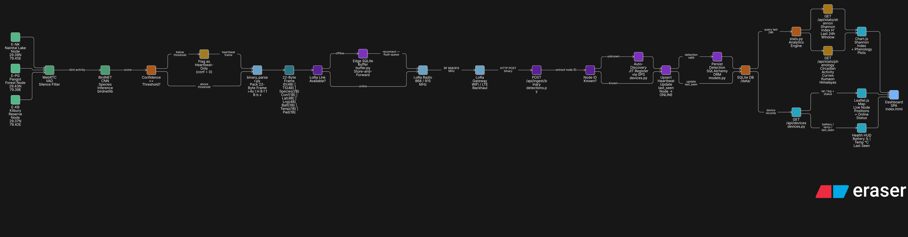

# System Architecture

EchoSense is a distributed acoustic monitoring platform designed for high-resolution wildlife tracking in remote, low-bandwidth environments.

### System Architecture Diagram

## 1. Edge Intelligence Layer
The edge devices (simulated or real hardware) handle the heaviest computational load to minimize data transmission costs.

### Audio Pipeline
- **Acquisition**: 16-bit mono 44.1kHz audio stream.
- **Preprocessing (VAD)**: Uses `webrtcvad` to identify voice/bird activity, waking the system from low-power states only when relevant sound is detected.
- **Inference (BirdNET)**: Runs the BirdNET CNN model natively to classify species with high confidence (typically >= 0.70).

### 22-Byte LoRa Binary Protocol
To survive on low-power wide-area networks (LPWAN), detections are packed into a custom 22-byte binary payload:

| Field | Size | Type | Description |
| :--- | :--- | :--- | :--- |
| `device_id` | 4B | `char[4]` | Unique node identifier (e.g., `E-NK`) |
| `timestamp` | 4B | `uint32` | Unix epoch time |
| `species_idx`| 2B | `uint16` | Index in the regional species pool |
| `confidence` | 1B | `uint8` | 0-100 score |
| `latitude` | 4B | `float` | GPS Latitude |
| `longitude` | 4B | `float` | GPS Longitude |
| `battery_pct`| 1B | `uint8` | Battery level 0-100 |
| `temp_c` | 1B | `int8` | Ambient temperature |
| `padding` | 1B | `byte` | Alignment byte |

---

## 2. Backend Processing Layer
A high-throughput FastAPI service built to manage the sensing grid.

### Ingestion Logic
- **Protocol Decoding**: The `binary_parser.py` maps the 22-byte streams back into structured JSON objects.
- **Auto-Registration**: The backend automatically registers any unknown `device_id` found in a valid payload, allowing "zero-config" field setup.
- **Validation**: Strict composite uniqueness checks (`device_id` + `timestamp` + `species`) prevent duplicate telemetry artifacts.

---

## 3. Data Visualization Layer
A premium dashboard designed for rapid ecological assessment.

- **Spatial Analytics**: Leaflet-based heatmaps visualize migration patterns and activity hotspots.
- **Diversity Indexing**: Calculates the **Shannon Index** and **Species Richness** in real-time.
- **Phenology Tracking**: 24-hour and seasonal activity curves for every detected species.
